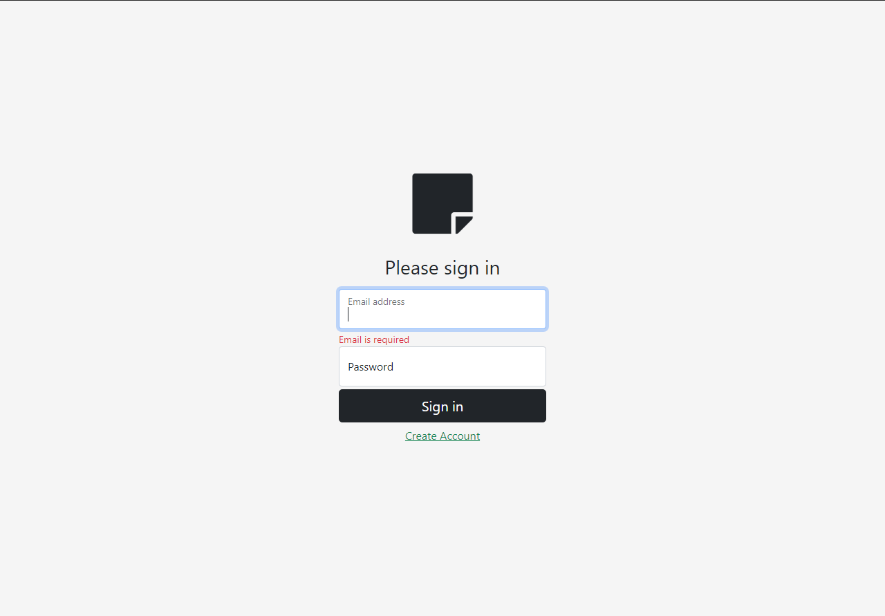
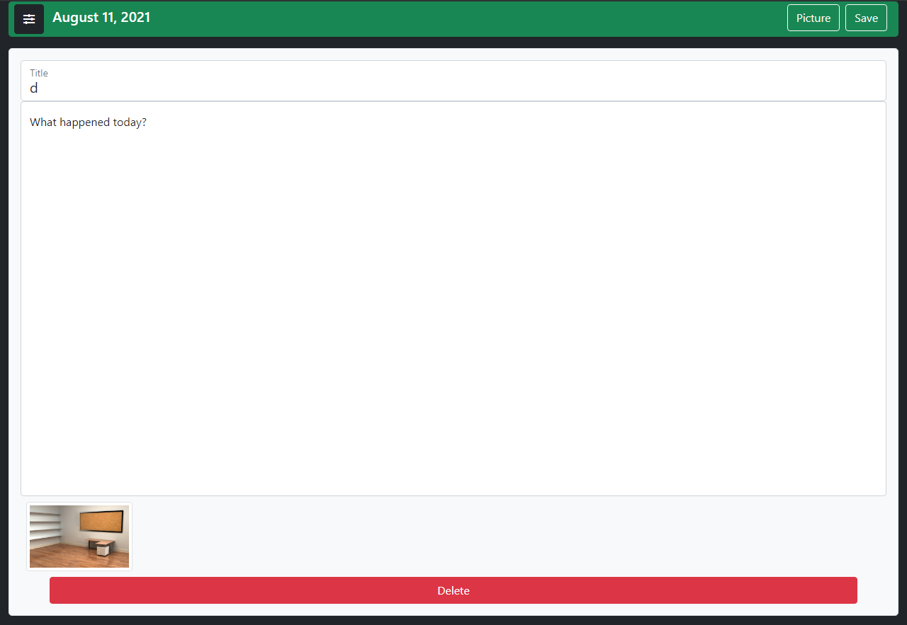

# Note App
App to create, edit, delete and save personal notes using an account which has to be created with your email.

Note App Backend: [https://github.com/DiegoRodriguez-sc/note-app-backend](https://github.com/DiegoRodriguez-sc/note-app-backend)




### Built With 🛠️


* [React.js](https://es.reactjs.org/)
* [Redux](https://es.redux.js.org/)
* [css](https://sass-lang.com/)
* [bootstrap](https://getbootstrap.com/)


## Live demo 🔴

Sitio Web - []().


## Getting Started 🚀

This is an example of how you may give instructions on setting up your project locally.
To get a local copy up and running follow these simple example steps.

### Installation

1. Clone the repo
   ```sh
   git clone https://github.com/DiegoRodriguez-sc/note-app-frontend.git
   ```
2. Install NPM packages
   ```sh
   npm install
   ```
3. Run `note app`
   ```sh
   npm start
   ```


## Contact ☎️

 * [Linkedin](www.linkedin.com/in/diego-rodriguez-sc)

* Project Link: [https://github.com/DiegoRodriguez-sc/note-app-frontend](https://github.com/DiegoRodriguez-sc/note-app-frontend)